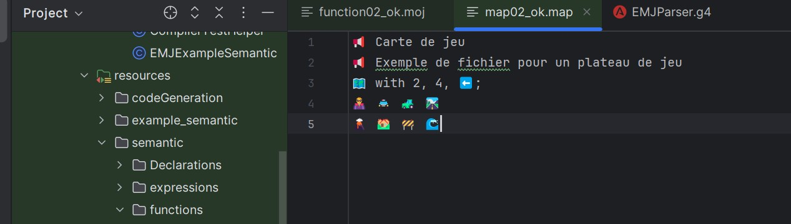
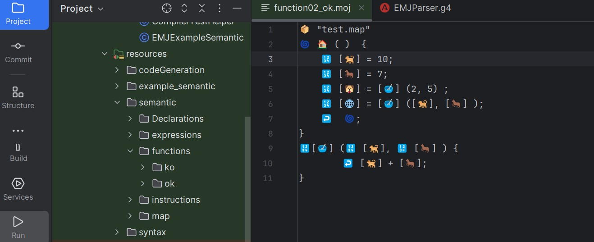

# projetEmjUnamur


# 🐹 EMJ – Emoji MicroJava DSL


**EMJ** est un **langage spécifique (DSL)** conçu pour programmer des **robots éducatifs** (par ex. Cutebot) en utilisant une **syntaxe à base d’émojis** 🎉.  

Il compile des fichiers `.emj` et `.map` vers du **code MicroPython exécutable** sur microcontrôleurs.


---


## 🚀 Objectif du projet


- Permettre de contrôler un robot éducatif avec des **instructions visuelles** (émojis).  

- Fournir une **infrastructure de compilation** complète :

 - Analyse lexicale et syntaxique (**ANTLR4**)

 - Vérifications sémantiques (table des symboles, portée, types)

 - Génération de code MicroPython

 - Gestion des erreurs conviviale

 - Tests automatisés (JUnit)


---


## 🛠️ Stack technique


- **Java 17**  

- **Maven** (build & dépendances)  

- **ANTLR4** (génération du lexer/parser)  

- **JUnit 5** (tests unitaires et d’intégration)  

- **Log4j2** (logging)  


---


## 📂 Structure du projet


```

emj/

├─ pom.xml                  # Config Maven

├─ src/

│  ├─ main/

│  │  ├─ antlr4/            # Grammaire ANTLR (EMJ.g4)

│  │  ├─ java/be/unamur/... # Code du compilateur

│  │  │   ├─ emj/           # Visiteurs, générateurs de code

│  │  │   ├─ main/          # Main + gestion erreurs + symbol table

│  │  │   └─ exception/     # Exceptions custom

│  │  └─ resources/         # Config (log4j2.xml, messages)

│  └─ test/

│      └─ java/be/unamur/...# Tests unitaires et d’intégration

├─ cubot_movements.map      # Exemple de programme EMJ

├─ test.map                 # Exemple de map

└─ README.md                # Ce fichier

```


---

## 📸 Captures / démos  


### Test pour une map




 ###Traduction en Python:


# Métadonnées

title = "📢 Carte de jeu"

description = "📢 Exemple de fichier pour un plateau de jeu"


# Carte : 2 x 4, orientation = LEFT

rows = 2

cols = 4

orientation = "⬅️"  # gauche


# Plateau de jeu (grille)

grid =  [

   ["🦹", "🚔", "🚜", "🛣️"],

   ["🌋", "🏘️", "🚧", "🌊"]

]


# Affichage

print(title)

print(description)

print(f"Dimensions: {rows} x {cols}")

print(f"Orientation: {orientation}")

print("nPlateau :")

for row in game_map:

   print(" ".join(row))


Traduction en java

public class  {

   public static void main(String[] args) {

       // Métadonnées

       String title = "📢 Carte de jeu";

       String description = "📢 Exemple de fichier pour un plateau de jeu";


       // "🗺️ with 2, 4, ⬅️;"

       int rows = 2, cols = 4;

       String orientation = "⬅️";


       // Grille 2x4 exactement comme ton fichier

       String[][] map = {

           {"🦹", "🚔", "🚜", "🛣️"},

           {"🌋", "🏘️", "🚧", "🌊"}

       };


       // Affichage

       System.out.println(title);

       System.out.println(description);

       System.out.println("Dimensions: " + rows + " x " + cols);

      System.out.println("Orientation: " + orientation);

      System.out.println("nPlateau :");

      for (int i = 0; i < rows; i++) {
         for (int j = 0; j < cols; j++) {

              System.out.print(map[i][j] + " ");
         }
          System.out.println();

      }
   }

}


### test de fonction

### Test pour une fonction




traduction en python


def var_bowl(var_0, var_1):

  return var_0 + var_1


def main():

   var_0 = 10         # [🐕]

   var_1 = 7          # [🐎]

   var_2 = var_bowl(2, 5)       # [🐶] = [🥣](2,5)

   var_3 = var_bowl(var_0, var_1)  # [🌐] = [🥣]([🐕],[🐎])


   return main   # ↩️ 🌀     # ou bien : return var_3 


---


## ✅ Fonctionnalités   


- **Analyse syntaxique** : grammaire ANTLR complète pour la syntaxe EMJ.  

- **Analyse sémantique** :  

 - Déclarations & portées (`SymbolTable`)  

 - Vérification de types  

 - Fonctions & variables (`FunctionSymbol`, `VariableSymbol`)  

- **Génération de code** : visiteur dédié (`EMJCodeGeneratorVisitor`).  

- **Gestion des erreurs** :  

 - Logs détaillés (`EMJErrorLogger`)  

 - Exceptions custom (`EMJErrorException`, `ParsingException`, etc.)  

- **Tests unitaires** : couverture sur déclarations, expressions, instructions, fonctions, code Cutebot.  


---


## 🧪 Exécution des tests


```bash

mvn test

```


Les tests valident :

- la grammaire ANTLR (parsing correct/erreurs attendues)  

- la sémantique (déclarations, fonctions, instructions, expressions)  

- la génération MicroPython (via fichiers `.map` de démo)  


---


## 📸 Exemple d’utilisation pédagogique


- Le compilateur traduit en **MicroPython**.  

- Le code s’exécute sur un robot (ex. **Cutebot**) via un microcontrôleur compatible.  


---


## 👤 Auteur


**Danielle Goudji**  

- 📧 [dgoudji@yahoo.fr](mailto:dgoudji@yahoo.fr)  

- 💼 [LinkedIn](https://linkedin.com/in/ingrid-goudji-a9465aa5)  

- 🐙 [GitHub](https://github.com/DanielleIngrid)  


---


## 📄 Licence / usage


Projet académique présenté dans un **portfolio**.  

Le code complet est conservé en privé, mais peut être partagé **en entretien**.


